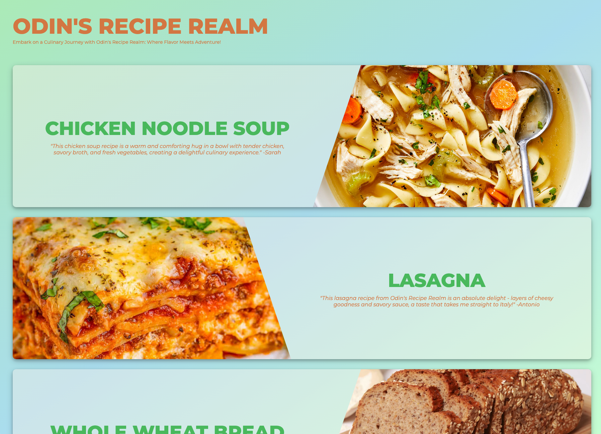

# Odin-Recipes

This repository contains a simple practice recipe website, where I have practiced basic HTML and CSS skills to create a delightful culinary experience. The website features a collection of delicious recipes and a clean, user-friendly design.

# Introduction

As a part of my learning journey in web development, I created this practice recipe website to hone my HTML and CSS skills through the Odin Project. This website showcases a variety of mouthwatering recipes, arranged neatly in separate cards, making it easy for users to find and learn a new dish.

# Features

- A visually appealing design with a focus on user experience.
- Recipe details pages with clear instructions and ingredient lists.
- Responsiveness for optimal viewing on different devices.
- CSS styling to enhance the overall look and feel of the website.

# Demo

[**View Demo Site**](https://vejtheguy.github.io/odin-recipes/)

